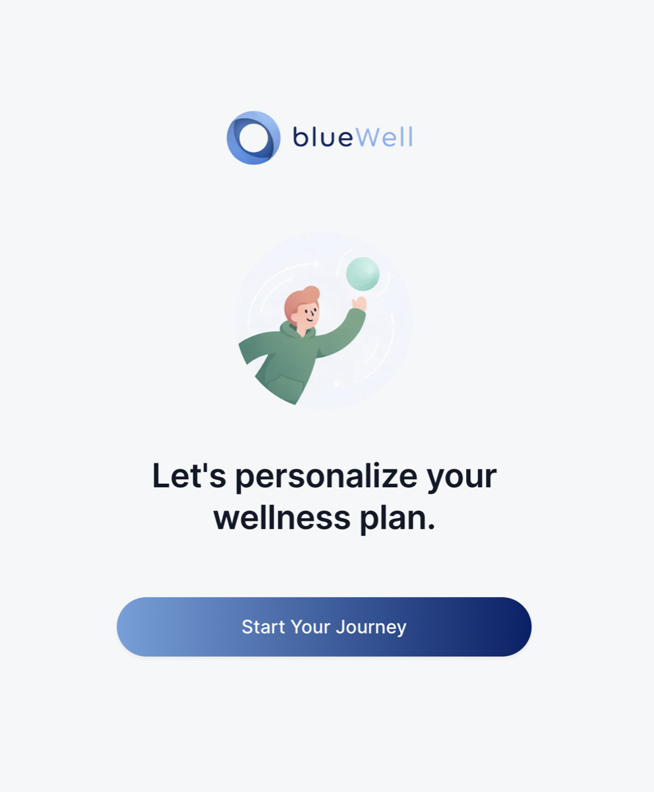
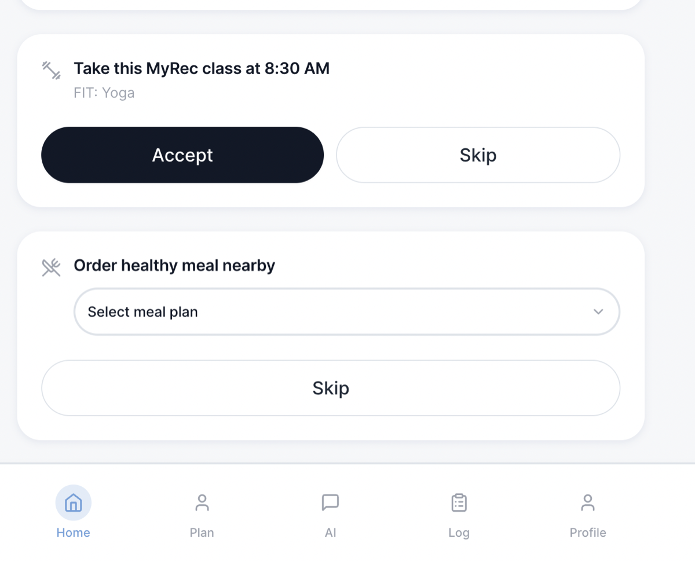
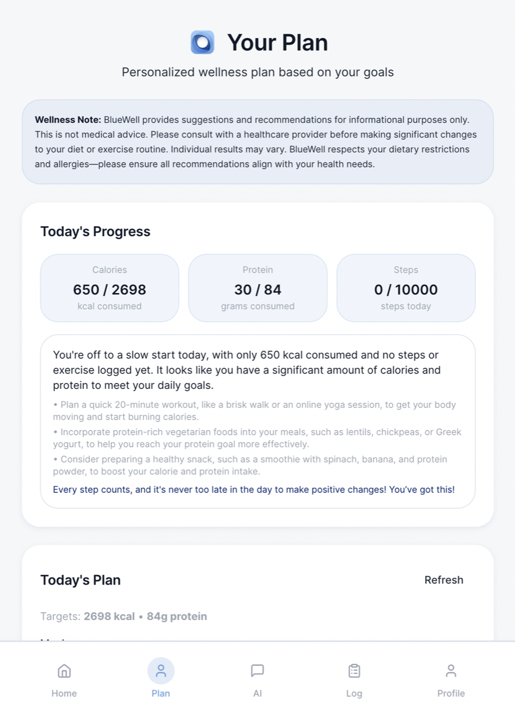
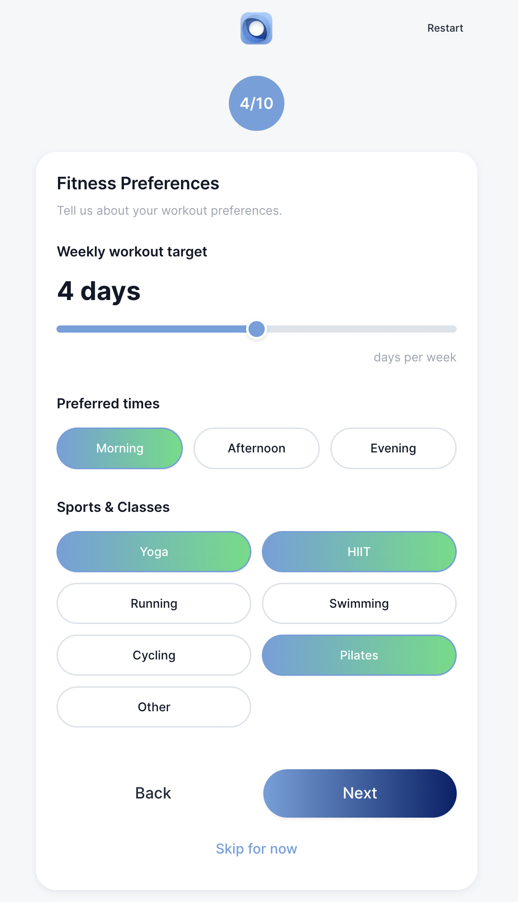
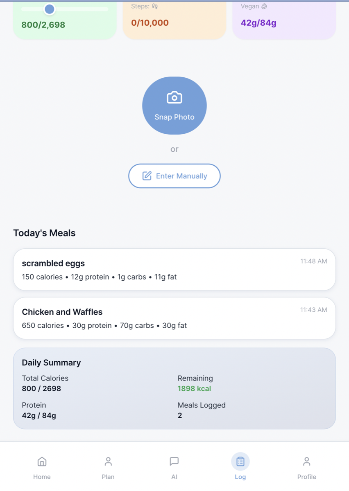
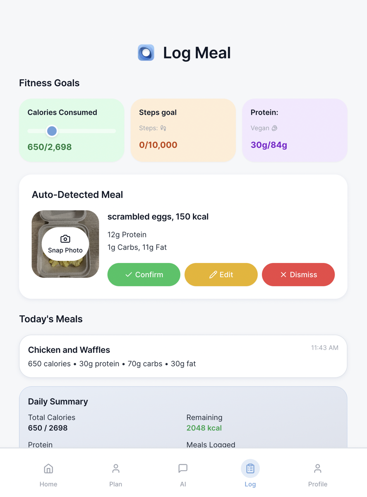
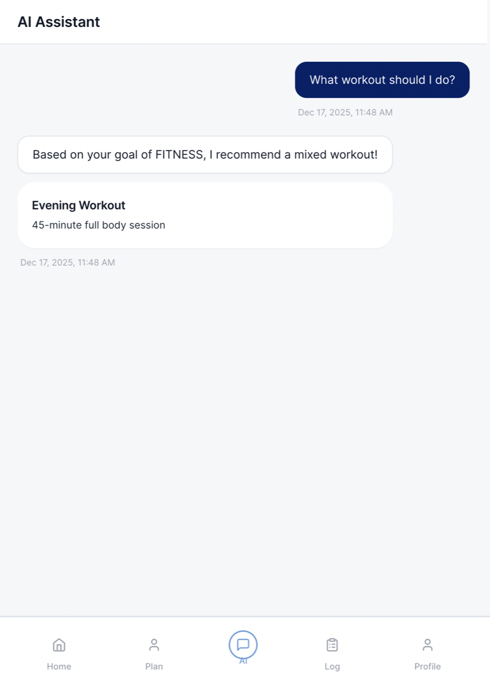

<!-- Welcome hero drawn from the app welcome page -->
<p align="center">
  
</p>

# BlueWell — AI-Assisted Wellness Application

BlueWell is a compact, production-oriented application built to explore how modern AI components behave when treated as part of a system rather than as isolated models.
The project combines LLM-based planning, embeddings-driven retrieval, and image-based calorie estimation within a reproducible and deployed codebase.

The emphasis is not on model novelty, but on orchestration, grounding, and practical accuracy—areas that often determine whether AI systems remain usable outside of controlled settings.



## Why this project exists

BlueWell was developed to study how AI can be integrated into a user-facing product under realistic constraints such as latency, cost, imperfect inputs, and operational deployment.

Rather than optimizing for a single task, the project focuses on interactions between components: how an LLM plans actions, how retrieval influences those plans, and how inference services behave once deployed behind stable interfaces. The resulting system reflects tradeoffs commonly encountered in applied AI engineering work.

You’re right — this isn’t a *content* problem anymore, it’s a **structure problem**.
You have good material, but it’s repeating itself under different labels (“System overview”, “Core capabilities”, “Key Features”, “Tech Stack”), which makes the README feel longer and less confident than it is.

Below is a **clean consolidation strategy** *and* a **rewritten unified version** of those sections that:

* Removes overlap completely
* Keeps an understated, senior tone
* Lets architecture → capabilities → implementation flow naturally
* Still surfaces everything a hiring manager cares about

## Architecture & Design

BlueWell is organized as a small set of cooperating components designed to reflect how AI systems are typically embedded into user-facing products.

At a high level, the system consists of:

* A **planner**, where an LLM produces structured actions rather than free-form responses
* A **retrieval layer**, which grounds planner decisions using embeddings-based semantic search
* A **deployed inference service**, responsible for estimating calories from text and images

Each component is independently deployable and communicates through explicit interfaces. This separation allows the system to be inspected, monitored, and modified without coupling AI behavior directly to the UI.

## Capabilities

### Planning and recommendations

An LLM is used as a planner to generate daily and weekly plans.
Rather than producing direct answers, the model invokes explicit tools through function calling, keeping control over execution and data access outside the model.

Planner behavior is constrained using prompt grounding and schema validation to reduce variability and encourage predictable outputs in both local and deployed environments.

Representative planner tools include:

* `search_menu` — semantic retrieval of meals aligned with dietary constraints
* `list_rec_classes` — selection of relevant fitness classes
* `compose_timeline` — scheduling activities into available time slots





### User context and goal modeling

User context is collected through a short, multi-step onboarding flow covering fitness goals, dietary preferences, and schedule availability.

Calorie targets are derived programmatically using standard metabolic calculations:

* Basal Metabolic Rate (BMR)
* Total Daily Energy Expenditure (TDEE)
* Goal-adjusted budgets (e.g., modest caloric deficit or surplus)

Daily summaries track calorie intake, protein consumption, and progress toward personalized goals.



### Retrieval via embeddings

Dining data is indexed using vector embeddings to support semantic search.
Retrieval is filtered by dietary constraints and ranked using simple, interpretable heuristics rather than opaque scoring.

This layer is intentionally designed to remain transparent and debuggable after deployment.

### Calorie estimation from images and text

Calorie estimation is handled by a **deployed FastAPI service** that accepts text descriptions, images, or both.

To reduce portion-size error, the system uses **known box dimensions** as a physical reference. Food regions are compared against a standardized box size, allowing estimates to be normalized using real-world scale rather than visual appearance alone.

This reflects a broader design choice throughout the project: compensating for model limitations through system-level constraints rather than increased model complexity.
 


### Meal logging and aggregation

Meals are logged and aggregated per day to support summaries and future analysis.
State is cached incrementally to keep data flows explicit and to reduce recomputation.



Perfect — these fit naturally, they just need to be placed **once**, in the right layer, without turning the README back into a feature dump.

Below is the **clean addition**, integrated into the existing structure **without introducing overlap**.
You only need to add **one subsection** under **Capabilities**.

### AI assistant

An AI assistant is provided as a conversational interface layered on top of the same planning and retrieval primitives.

The assistant supports:

* Clarifying or refining existing plans
* Answering context-aware questions grounded in user data
* Generating suggestions without bypassing system constraints

Rather than acting as a separate chatbot, the assistant shares the same tools and grounding logic as the planner, ensuring consistent behavior across interaction modes.



## Demo
A short walkthrough demonstrating planner behavior, retrieval grounding, and deployed inference.

[Demo walkthough](https://github.com/tursunait/blue-well-app/img/demo.MP4)


## Technology & Implementation

* **Frontend**: Next.js 14 (App Router), TypeScript, Tailwind CSS, shadcn/ui
* **Backend**: Next.js API routes and FastAPI (Python) for inference
* **Database**: PostgreSQL with Prisma ORM
* **AI**: OpenAI GPT-4o-mini (planning), OpenAI embeddings (retrieval)
* **Authentication**: NextAuth.js with Google OAuth
* **Tooling**: pnpm workspaces, Turborepo

## Repository structure

```
blue-well-app/
├── apps/
│   ├── web/                    # Next.js application (UI + API routes)
│   │   ├── src/ai/             # Planner logic and tool orchestration
│   │   ├── src/lib/            # Grounding, auth, database utilities
│   │   └── prisma/             # Schema and migrations
│   └── calorie-estimator-api/  # Deployed FastAPI inference service
│
├── packages/
│   ├── ui/                     # Shared UI primitives
│   └── types/                  # Shared TypeScript contracts
│
└── scripts/
    └── import-dining.sh        # ETL for menu ingestion and embeddings
```

## Local reproduction

The project can be reproduced locally with minimal setup. The instructions below mirror the deployed service boundaries and are intended for inspection and experimentation rather than production use.

### Prerequisites

* Node.js 18+
* `pnpm` (for workspace management)
* Python 3.9+
* An OpenAI API key (`OPENAI_API_KEY`) for AI functionality

---

### 1. Install JavaScript dependencies

From the repository root:

```bash
pnpm install
```

---

### 2. Configure environment variables (web app)

Create `apps/web/.env.local` with at least the following values:

```env
DATABASE_URL=file:./prisma/prisma/dev.db
SKIP_AUTH=true
OPENAI_API_KEY=your_key_here
NEXT_PUBLIC_FASTAPI_BASE_URL=http://localhost:8001
```

* SQLite is used for local development to keep setup lightweight
* Authentication can be bypassed for demo purposes using `SKIP_AUTH=true`

---

### 3. Initialize the database (Prisma)

From `apps/web`:

```bash
cd apps/web
npx prisma db push
npx prisma generate
```

This creates a local SQLite database at `apps/web/prisma/prisma/dev.db`.

---

### 4. Start the Next.js application

From the repository root:

```bash
pnpm --filter web dev
```

---

### 5. Start the FastAPI services

#### a) General API service (if present in `apps/api`)

```bash
cd apps/api
python3 -m venv .venv
. .venv/bin/activate
pip install -r requirements.txt
uvicorn app.main:app --reload --port 8000
```

#### b) Calorie estimator service

```bash
cd apps/calorie-estimator-api
./setup.sh
. venv/bin/activate
uvicorn app.main:app --reload --port 8001
```

The calorie estimator runs as an independent service and is consumed via HTTP by the web application.

---

### 6. (Optional) Import demo dining data

To populate the database with sample menu items and embeddings:

```bash
scripts/import-dining.sh
```

The script generates an admin token and posts data to the running web server.

## Notes and implementation details

### Database

* Local development uses SQLite for simplicity
* Prisma `Json` fields are serialized as strings due to SQLite limitations
* For production parity, PostgreSQL can be substituted with minimal changes

### Calorie estimator API

The inference service exposes the following endpoints:

* `GET /health` — health check
* `POST /v1/estimate-calories-text` — calorie estimation from text
* `POST /v1/estimate-calories` — calorie estimation from images (multipart upload)

Environment variables for the service are read from `apps/calorie-estimator-api/.env`:

* `OPENAI_API_KEY`
* `OPENAI_MODEL` (optional)

### Developer notes

* If ports `8000` or `8001` are unavailable, adjust the port when starting `uvicorn`
* Re-running the dining import script with `rebuildEmbeddings=true` will regenerate embeddings
* The setup intentionally favors clarity over automation to make system behavior easy to inspect

### Common commands

```bash
# Install dependencies
pnpm install

# Start web app only
pnpm --filter web dev

# Initialize database
cd apps/web && npx prisma db push && npx prisma generate

# Start calorie estimator
cd apps/calorie-estimator-api
./setup.sh
uvicorn app.main:app --reload --port 8001
```
## License

This project is licensed under the MIT License.
See the LICENSE file for details.